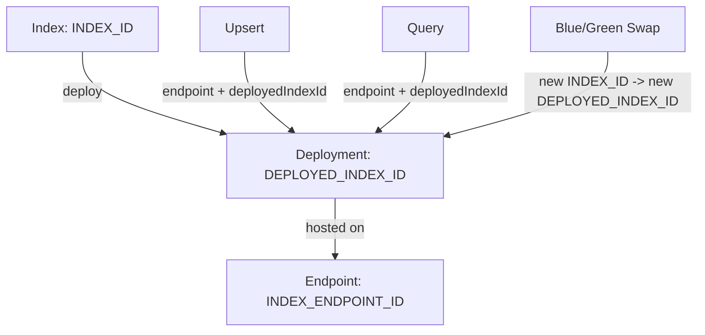

# Vector Search Roles and Flows

## Roles
- `INDEX_ID`: The vector index asset. Needed to deploy a new/updated index. Not used for queries/upserts once deployed.
- `INDEX_ENDPOINT_ID`: The serving endpoint. Stable “host” you deploy to and send traffic through.
- `DEPLOYED_INDEX_ID`: Your chosen name for a specific deployment on that endpoint; used to route queries/upserts.

## Dependency Breakdown

Here's a breakdown of the typical creation process and dependencies in a cloud vector search service (like Vertex AI Vector Search):

### 1. Creating the Index
- Action: Create a vector index (a data structure containing your vector embeddings).
- Inputs: Raw data, vector dimensions, algorithm type, etc.
- Output: Index ID (the unique identifier for the stored vector data).
- Dependency: This step does not depend on the Index Endpoint ID.

### 2. Creating the Index Endpoint
- Action: Create an Index Endpoint (a network-accessible service where indexes can be deployed).
- Inputs: Display name, network configuration (e.g., VPC), and regional location.
- Output: Index Endpoint ID (the unique identifier for the endpoint).
- Dependency: This step does not depend on the Index ID.

### 3. Deploying the Index
- Action: Deploy the vector index to the endpoint to make it queryable.
- Inputs:
  - The Index ID (which index you want to deploy).
  - The Index Endpoint ID (where you want to deploy the index).
  - A unique Deployed Index ID (a user-specified name for this specific deployment on the endpoint).
- Output: The index becomes available for querying via the endpoint's address.
- Dependency: This step has a direct dependency on both the Index ID and the Index Endpoint ID. Both must be created before the deployment can occur.

## Dev Use Cases
- First setup: create index → create endpoint → deploy index with a `DEPLOYED_INDEX_ID`.
- Data refresh: upsert datapoints using `INDEX_ENDPOINT_ID` + `DEPLOYED_INDEX_ID` (no `INDEX_ID` needed).
- Blue/green swap: create a new index (`INDEX_ID`), deploy it to the same endpoint with a new `DEPLOYED_INDEX_ID`, test by pointing clients to the new ID, then undeploy the old.
- Parallel personas/envs: separate endpoints per persona/env, or share one endpoint and use different `DEPLOYED_INDEX_ID`s (clients must specify which to hit).

## When Required
- Deploy: `INDEX_ID` + `INDEX_ENDPOINT_ID` + `DEPLOYED_INDEX_ID`
- Upsert: `INDEX_ENDPOINT_ID` + `DEPLOYED_INDEX_ID`
- Query: `INDEX_ENDPOINT_ID` + `DEPLOYED_INDEX_ID`
- Cleanup: undeploy by `INDEX_ENDPOINT_ID` + `DEPLOYED_INDEX_ID`; delete index by `INDEX_ID`; delete endpoint by `INDEX_ENDPOINT_ID`

## Diagram

---

## Why not always use a different Deployed Index ID?

The Deployed Index ID is the name of a specific route/instance running on a stable server (Index Endpoint ID). You generally want to keep this ID stable for two main reasons:

1. API/Application Stability: Your application code (the client) is configured to query a specific resource—the Index Endpoint ID and the Deployed Index ID (e.g., `my_endpoint/production_route`). If you change the Deployed Index ID every time you update, you must also update and redeploy the client application, which is cumbersome and risks downtime.
2. Stateless Deployment: The Deployed Index ID primarily points to a configuration (replicas, machine type, etc.) and a specific Index ID (the data). If you are just making an in-place update to the data (e.g., streaming new vectors), you don't need a new deployment name.

## When to Switch the ID

| Component to Change | The Index ID (The Data) | The Deployed Index ID (The Route/Instance) |
| :--- | :--- | :--- |
| What it Represents | The vector data and the physical structure (dimensions, algorithm, sharding). | The configuration of the deployment on the endpoint (e.g., replica count, machine type). |
| The Action is a... | Data Update or Structural Change | Deployment Configuration Change |
| Why Change It? | - You have a major, full data rebuild (e.g., re-running all embeddings).   - You are changing the core algorithm or vector dimension size.   - You are performing a zero-downtime blue/green deployment of a brand new Index (see below). | - You need to change replica counts (scale up/down).   - You need to change the machine type (if allowed by the platform).   - Never switch this ID for an update if your goal is client API stability. |
| Best Practice | Update the existing Index ID content in-place (for incremental/streaming updates). | Keep the Deployed Index ID stable and use it as a persistent route name. |

---

## The Key Scenarios (Switching Index ID vs. Deployed Index ID)

### 1. Switching the Index ID for a Zero-Downtime Deployment (Blue/Green)

This is the most critical workflow where you deliberately switch the underlying Index ID while keeping the Deployed Index ID stable.

- Goal: Replace the entire corpus of data with a new, fully rebuilt index without any interruption to live traffic.
- Steps:
  1. Traffic is hitting Endpoint A / Deployed ID: `v1-live` (this points to Index ID: `I-v1`).
  2. You build a completely new index (Index ID: `I-v2`).
  3. You use the service's mutate/swap operation to tell the existing Deployed ID `v1-live` to now point to Index ID `I-v2`.
  4. The system smoothly unloads `I-v1` and loads `I-v2` onto the live deployment resources, while the client continues to query the stable endpoint (`v1-live`).
- Result: The Index ID changes from `I-v1` to `I-v2`, but the Deployed Index ID remains a stable route (`v1-live`) that your application code never had to touch.

### 2. Keeping the Index ID Stable for Incremental Updates

This is the standard use case for most running services.

- Goal: Add, update, or delete a few vectors.
- Action: Perform an Upsert (or Streaming Update) operation directly on the original Index ID or its deployment.
- Result: The Index ID remains the same, and the Deployed Index ID remains the same. The deployed resources synchronize with the small, incremental data changes.

### 3. Switching the Deployed Index ID (Less Common)

Only create a new Deployed Index ID on the same Index Endpoint if you need a separate environment or a unique resource configuration.

- Scenario: You need a "staging" version of the index to test query results or performance on a smaller, cheaper machine before moving to the full production size.
- Steps:
  1. Deploy Index ID `I-v1` to Endpoint A with Deployed ID `staging` (e.g., 2 replicas).
  2. Deploy the exact same Index ID `I-v1` to Endpoint A with Deployed ID `production` (e.g., 10 replicas).
- Result: Testing applications query `staging`, while live applications query `production`. The only difference is the deployment configuration, not the data itself.
